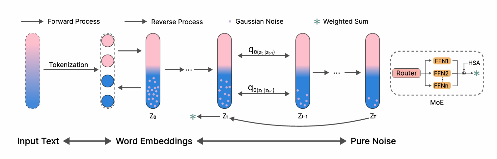

## 感谢你的访问 👋 

我是一名中山大学2023级的本科生，欢迎来到我的主页👏👏

- 🌱 我最近在学习 **游戏策略Agent，因果VLM，多智能体协作策略，机器人技术等**

- 👯 我期望能与他人合作进行 **机器人技术开发，多模态，智能体协作等**

### 📝 Publications

  
  

    

    <strong>DrDiff: Dynamic Routing Diffusion with Hierarchical Attention for Breaking the Efficiency-Quality Trade-off</strong>
    

    
<strong>EMNLP 2025 MainConference</strong>

    

      Jusheng Zhang, Yijia Fan, <strong>Kaitong Cai</strong>, Zimeng Huang, Xiaofei Sun, Jian Wang, Chengpei Tang, Keze Wang
    

  

